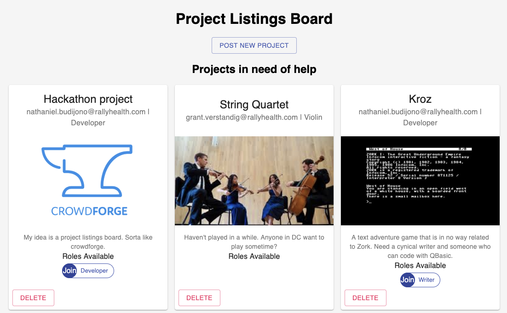

# project-listings-board

Have you ever struggled to coordinate teams for a hackathon event or interest group projects?
This web app will make it easier to coordinate projects, by allowing you to post and/or join projects based on roles.

## Project Info

This started as a 24 hour Hackathon project with @nathanielbd, on July 12, 2019

Built with Create-React-App and Webtask as the backend and storage.

### Current Features

- Post new project
- Upload preview image
- Join project by role (to see contact info)
- Delete project

### Additional feature ideas

- Log In
- SSO with Github
- Filter Projects
- Search Projects
- Edit project details
- Hide projects that are full
- Add project description tags
- User Profile Page that shows active/completed projects
- User Github URL or links to previous projects
- User skill tags to allow recruiting
- Recommend projects based on user's skill tags
- Remove member
- Leave project
- Public/Private projects
- Host events
